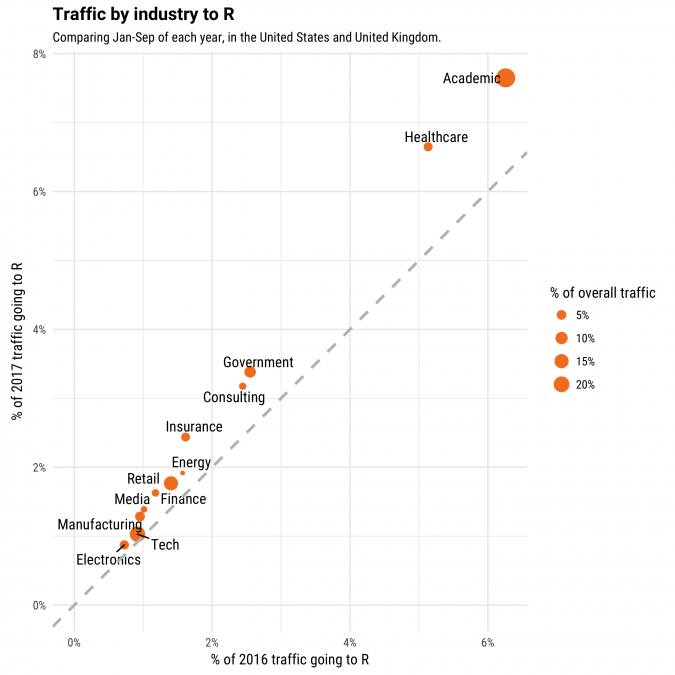

```{r setup, include=FALSE}
knitr::opts_chunk$set(echo = TRUE)
```

\newpage

# Preface

Reproducibility is one of the cornerstones of science advancement according to the [NIH](https://www.nih.gov/research-training/rigor-reproducibility). Given R's increasing popularity in biotech and research as well as the aims of rOpenSci, there is a great need to provide frameworks or tools that seek to improve reproducibility and offer R users more comprehensive and easier options to achieve reproducibility. Currently, there are a number of R packages that seek to improve reproducibility. The [containerit](https://github.com/o2r-project/containerit) and [rocker](https://github.com/rocker-org/rocker) projects are examples that incorporate containerization via docker. However, many R users in biotech and research (specifically academic environments) don't typically have access to docker given it's a newer technology, it's not widely adopted by academic institutions due to potential system [vulnerabilities](https://docs.docker.com/engine/security/security/#docker-daemon-attack-surface), and it typically requires administrative privileges. In these types of situations, [conda](https://docs.anaconda.com/anaconda/user-guide/tasks/use-r-language/) is a preferred framework and by far one of the most popular options for reproducibility.  In other cases, users to different R packages including [packrat](https://github.com/rstudio/packrat), [checkpoint](https://github.com/RevolutionAnalytics/checkpoint)(MRAN), [miniCRAN](https://github.com/andrie/miniCRAN), [drat](https://github.com/eddelbuettel/drat), [workflowr](https://github.com/jdblischak/workflowr), and [rbundler](https://cran.r-project.org/web/packages/rbundler/index.html) for reproducibility.  While these packages have tremendous value to R users, they limit users to using an interactive R session (the R shell).

# Scope 

## Comparing Programming Languages

Many of the popular programming languages in the bioinformatics community have a command-line package manager that offers access to a standard or customizable package repository.  Python has [pip](https://pypi.org/project/pip/) and [PyPi](https://pypi.org/), Javascript has the [npm-client](https://github.com/npm/cli) and [npm-registry](https://docs.npmjs.com/misc/registry), and Ruby has the [gem-client](https://github.com/rubygems/rubygems) for [RubyGems.org](https://rubygems.org/).  R has [CRAN](https://cran.r-project.org/) and [Bioconductor](https://www.bioconductor.org/), which are package repositories, but R doesn't have an easy (as compared to pip or npm) way to install packages globally or locally via the command-line. Improving the management of R package installation and removal could boost reproducibility for projects and boost the userbase by offering an option specifically for the bioinformatics community.

In addition to package management, it is often important for R users to install R from source.  HPC systems generally need R installed from source because system admins desire specific global configurations.   More specifically, HPC system users need to install R in locally order to utilize a specific version of R (or a package that depends on a specific R vversion) or to have a custom configuration of R in their environment.  Other programming languages including Python ([pyenv](https://github.com/pyenv/pyenv)) and Ruby ([rbenv](https://github.com/rbenv/rbenv) and [ruby-build](https://github.com/jdblischak/workflowr)) have third-party interfaces that manage the installation and management of various versions of the language which aids in the reproducibility of an environment for project as well as localization of a project's dependencies.

With these ideas in mind, we propose [beRi](https://github.com/datasnakes/beRi), a suite of tools for managing R.  beRi will depend on three independent tools that work towards providing new options for managing R virtual environments, R package management, R installation management, and other R utilities all from the command line.  beRi will be built on top of this toolset, and provide a more hollistic experience by adding project management and configuration.

\newpage

## Comparing R Workflows

As a well-developed language, R is loved and used by a diverse group of individuals and is [rising in popularity](https://blog.revolutionanalytics.com/popularity/) for a variety of reasons.  R is trafficked, most notably, by individuals from the healthcare industry, academic institutions, and government entities as seen by a recent stackoverflow analysis [[1](https://stackoverflow.blog/2017/10/10/impressive-growth-r/)]:
  
```{r fig.width = 2, fig.align='center', echo=FALSE, out.width="55%"}

```

Bioinformatics professionals are incorporated into all of the top 3 categories.  In fact, the bioinformatician is our target audience for the beRi suite of tools.  Other interested parties include researchers in basic or clinical sciences, biologists, clinicians, data scientists, data analysts, system administrators, HPC system users, R package developers, and lovers of the command line.  beRi will also appeal to new users of R who are used to Python and/or command line interfaces.  While the current workflow options allow R users to successfully perform analyses and manage projects, a good sign of a healthy programming ecosystem is the availability of multiple solutions to the same problem.  The most popular options remain to be conda/bioconda, packrat/jetpack, and docker (rocker/containerit) respectively.

Docker seems to be a holistic solution as containerization produces an exact replicate of your project's environment at the operating system level.  The primary barrier for Docker is that there are a limited number of individuals in academia and the healthcare industry who can utilize this technology.  RStudio's packrat solution is also an excellent tool for "containing" packages within a project. However, packrat builds for large projects can be computationally intensive, which results in slower build times.  Anaconda's ecosystem for R is most similar to our approach and has also been the main subject of many questions about beRi after we proposed it informally in the rstats reddit community:

> "How does this differ from conda?"
> "What are the benefits of using beRi over conda?"

A more detailed comparison of beRi and conda (along with other popular tools) can be seen in the table below.  The main benefit and goal of beRi is to connect users directly to the R's most popular repositories (CRAN, Bioconductor, MRAN, GitHub, etc.) and provide a means for micromanaging the R environment in one toolset with an intuitive command line interface.  While conda accomplishes some of the same goals, the CLI is inevitably attached to anaonda's repositories, which limits R users from easily integrating bleeding edge R packages or updates to them.

 <!-- Insert Table -->

In this context, beRi is not meant to replace existing tools, but to incorporate another toolset into the R ecosystem.  We would like to provide alternative workflows as well as new technologies for the R programming language that could help grow and maintain the R community at large.  

\newpage

# The Team

[Team-beRi](https://github.com/orgs/datasnakes/teams/team-beri) is a group of individuals who are passionate about reproducibility in science but have experienced the limitations of existing tools which support reproducible analyses with R. Bridging that gap was the motivation for prototyping beRi at hackseq18 and winning the popular votes exhibits that there is a strong interest and need for this tool in at least the bioinformatics community.

We are familiar with Python, R, and Bash from our daily work and plan to use these languages as the building blocks of the project. Some of us have software engineering experience to help with the development process. Since we will be both makers and users of this tool and are surrounded by fellow R users in science, we can continually improve beRi by adapting frequent feedbacks from ourselves and our community who will be the end users of beRi.

Presently, our team is divided into "tiers" of individuals based on experience level and willingness to contribute in the long term.  In the short term, we are using the terms "Project Manager", "Lead Maintainer", and "Contributor" to manage our responsibilities.  The beRi team will develop under the [DataSnakes](https://github.com/datasnakes) organization on GitHub.  All of the current contributors participated in developing beRi at the Hackseq 2018 bioinformatics hackathon in Vancouver, BC.  Team beRi walked away from the hackathon as [winners](https://www.hackseq.com/) by popular vote after developing compelling demos of the command line tools.

## Project Manager

beRi was originally conceived by [**Rob Gilmore**](https://www.linkedin.com/in/robert-gilmore-7b451592).  At hackseq18, his leadership skills and project management experience guided Team beRi to success as the winners of the hackathon.  Gilmore's skillsets are derived from his education in [Biomedical Engineering](https://www.abe.msstate.edu/academics/undergraduate/biomedical-engineering/curriculum/) at Mississippi State University, professional development at [Engineering Research and Development Center](https://www.erdc.usace.army.mil/), and extensive Bioinformatics experience as a Researcher in the fields of Genetics and Psychiatry using non-human primate models.  In his current position at the [University of Mississippi Medical Center](https://www.umc.edu/som/Departments%20and%20Offices/SOM%20Departments/Psychiatry-and-Human-Behavior/Centers/Divisions,%20Centers,%20Divisions%20and%20Research/Neurobiology-and-Behavior-Research/Overview.html), he has utilized the [Mississippi Center for Computational Research's](https://mcsr.olemiss.edu/research/) HPC system to manage and develop large-scale bioinformatics pipelines using Linux, Windows, Python, R, and Bash.

## Lead Maintainers

* **Shaurita D. Hutchins** is a Researcher II in the [Department of Psychiatry and Human Behavior's division of Neurobiology and Behavior Research](https://www.umc.edu/som/Departments%20and%20Offices/SOM%20Departments/Psychiatry-and-Human-Behavior/Centers/Divisions,%20Centers,%20Divisions%20and%20Research/Neurobiology-and-Behavior-Research/Overview.html) at the University of Mississippi Medical Center. She received her Master of Science in Biological Sciences from Missisippi College. She has extensive experience with Python package development, R package development, web development (including rshiny apps and flask apps), genomics pipeline development, data analysis using Python, and data visualization using R. She is the co-creator of the [Datasnakes](https://www.datasnakes.org/), an open-source and open-science organization and acts as the maintainer for multiple repositories/projects for the organization.

* **Santina Lin** is currently a software engineer at Microsoft and works on maintaining the [RevoScaleR](https://docs.microsoft.com/en-us/machine-learning-server/r-reference/revoscaler/revoscaler) package as well as adding R and Python runtime to SQL server. She completed her master's degree in Bioinformatics at the University of British Columbia where she used R for data analysis and visualization. She has also taught R and statistics in a graduate level course as a teacher assistant.

* **Bruno Grande** is a PhD candidate working on cancer genomics in [Ryan Morin’s lab](https://morinlab.github.io/) at Simon Fraser University. He's an advocate for best practices in academic data science to overcome the reproducibility crisis affecting most of scholarly research. He dreams of publishing a Git repository that contains everything needed to reproduce every analysis from his PhD project with a single command. beRi plays an important role in making this dream possible. 

## Contributors

<!-- Veena Ghorakavi -->

<!-- Zhi Yuh Ou Yang -->

<!-- Michelle Lee -->

<!-- Kristen Bystrom -->

## Other Interested Parties

<!-- Hamid Younesy -->

# The Plan

beRi is a suite of Python packages which is composed of a virtual environment manager for R ([renv](https://github.com/datasnakes/renv)), an R installation and R version manager ([rinse](https://github.com/datasnakes/rinse)), and an R utility tool for installing packages, managing native R configuration files, and setting up local CRAN-like repositories ([rut](https://github.com/datasnakes/rut)). These packages will be developed in separate repositories as standalone or fully independent CLI’s, and [beRi](https://github.com/datasnakes/beRi) will also be developed in a separate repository.  However, the beRi CLI will depend on the other three packages, which will provide an enhanced and comprehensive experience as well as project management support.

To begin, these packages will be built with Python for Linux systems starting with the latest Ubuntu release with long term support.  We will optimize our Python packages for the R ecosystem by using the [R manuals](https://cran.r-project.org/doc/manuals/), which can be found on the CRAN website.  Following stable builds, we will test under various Linux distributions, followed by Windows 7 and above, and finally, macOS systems.  These python packages are currently being managed by [poetry](https://github.com/sdispater/poetry) for ease of use and intuitive workflow; however, we have also considered switching to [pipenv](https://github.com/pypa/pipenv) in the future if poetry does not satisfy our needs.  The [click](https://palletsprojects.com/p/click/) package will be used to build the command line interface, which is the primary feature of these tools.  


## Standalone CLI - renv

renv (short for R virtual environment) is a python-style virtual environment package for R and is the most developed of the three standalone tools.  It will use Python's venv [EnvBuilder](https://github.com/python/cpython/blob/3.6/Lib/venv/__init__.py#L17) module along with [cookiecutter](https://github.com/audreyr/cookiecutter) in order to deploy the proper shell scripts (activate) and R configuration files (.Rprofile, .Renviron).  A directory will be utilized in the users home directory (~/.renv) as a repository for any environment created.  The environments created with renv will not only be configurable with the normal .Rprofile/.Renviron files, but also a custom renv.yaml config file located in the root of the environment directory (~/.renv/<env-name>/renv.yaml).  This file will also allow the user to set up default environment variables, CRAN mirrors, and to set default packages to install.  The renv CLI will also contain a default yaml file for all newly created environments.

## Standalone CLI - rinse

rinse (short for R installer) is currently a simple installer for the latest version of R.  In the future, we would like to implement features similar to [pyvenv](https://github.com/pyenv/pyenv/blob/master/COMMANDS.md).  This includes installing/uninstalling R from source, managing some of R's dependencies, and switching in between version of R.  Installing Microsoft R-Open or [other R implementations](https://en.wikipedia.org/wiki/R_(programming_language)#Implementations) will also be considered.  After linux development is stable, a long-term goal is to provide support for the installation of Rtools on Windows systems.

## Standalone CLI - rut

rut (short for R utilities) will be an R package manager that will also be able to set up local CRAN-like repositories as well as manage custom R configuration files like .Rprofile and .Renviron.  In its current iteration, rut can install packages from CRAN using R's remotes package. As the least developed package and likely the most difficult to implement, rut will require more attention in order to develop it with best practices and effectively integrate it with beRi. With regards to rut, we have discussed wrapping the R CMD INSTALL command, integrating a simpler version of [jetpack](https://github.com/ankane/jetpack), or utilizing [rpy2](https://rpy2.readthedocs.io/en/version_2.8.x/) for getting interpreter specific information.

## Integrated CLI - beRi

The primary and initial goal for the beRi suite of tools was to create standalone Python packages that were completely independent of each other.  To develop the base of our ideas (renv, rinse, and rut), we looked to other well developed programming languages for inspiration.  Further insight has come from R manuals and various documentation in order to keep the R ecosystem and R community in mind.  The integration of renv, rinse, and rut under the beRi CLI will help us develop a custom project workflow with one cohesive interface.  Once the standalone tools are at a functioning level, we will develop an analogous YAML configuration workflow for each package.  This configuration will be leveraged in the beRi CLI.  Not only will this allow us to configure our environment with one YAML file, but it will also allow us to develop a beRi file-system that centralizes our envrionment's files and folders.  The ~/.beRi folder for instance will contain any renv environments, R installations, CRAN-like repositories, and .libPaths() associated with beRi processes by default.  Further dialog will be needed to discuss managing projects with the beRi CLI, which we will continue to do throughout the development lifecycle.    While the development of beRi will inevitably effect some of the changes we make to the standalone CLI, we will never limit renv, rinse, or rut by linking them to each other or to beRi.

# Project Milestones

The planning phase is a continuous effort.  In order to establish a higher level means of project management for the beRi suite of tools we have decided to use several useful technologies.  GitHub will be the primary means of managinging the project.  ZenHub also has some additional features that will help contributors see the project from different angles.  Using ZenHub Milestones, Estimates, Epics, and Pipelines will help us generate time-lines based on the category, difficulty level, quantity, stage of development, and the priority level of various tasks.  ToDoist will be used for general task management.  SLACK will be another interface for higher level discussion and communication between collaborators and users of the beRi Suite of Tools.

## beRi for Linux (Version 1.0)

For the first year the beRi Suite of Tools will be tested under the Linux OS.  The dates represent estimated point of completion based on the pace we set at hackseq18.  More accurate dates will be possible after further managing our workload with ZenHub.

* Development for Linux (Ubuntu LTS) - June 15, 2019
  * renv - February 15, 2019
    * Successfully Virtual Environments - Completed
    * Resolve minor R warnings - January 15, 2019
    * Code clean up - February 15, 2019
  * rut - March 15, 2019
    * Package Manager - February 15, 2019
    * Code clean up - March 15, 2019
    * Secondary Goal - Manage local CRAN-like repositories
    * Secondary Goal - Manage packrat projects
  * rinse - April 15, 2019
    * Manage the Installation of R from source - March 15, 2019
    * Add Microsoft R Open - April 15, 2019
    * Code clean up - May 15, 2019
    * Secondary Goal - Reverse engineer pyenv
    * Consider other distributions of R
  * beRi - May 15, 2019
    * YAML config for renv, rut, rinse - April 15, 2019
    * YAML config for beRi - May 15, 2019
    * beRi filesystem - June 15, 2019
    * Code clean up - June 15, 2019
    * Secondary Goal - Add beRi projects
* Development for other Linux Distributions - July 15, 2019

# How Can the ISC Help

# Dissemination

# References


  
